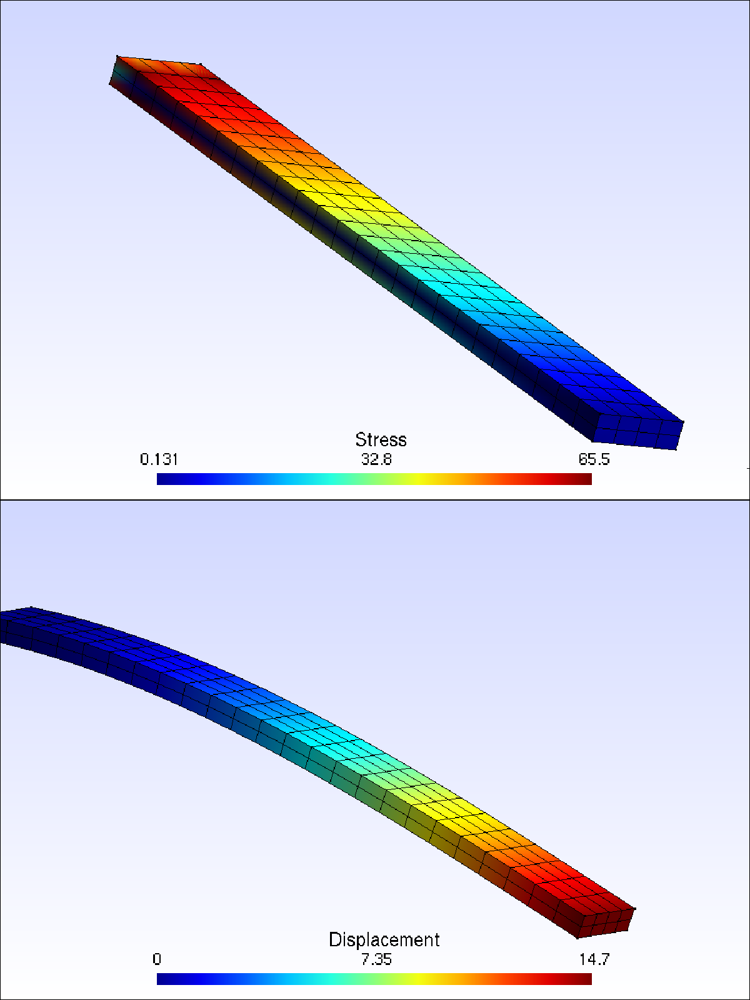
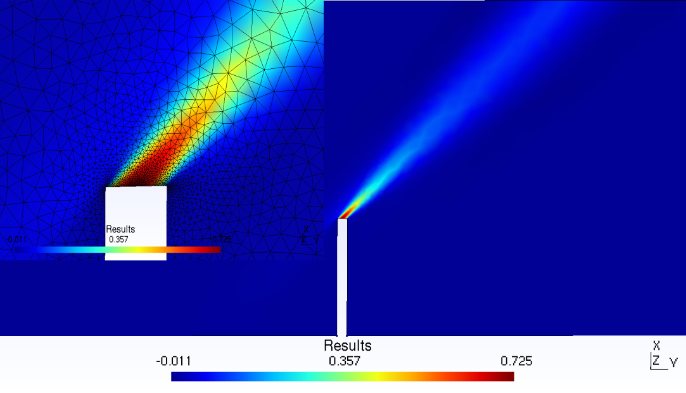

# ProjectFEA
## The goal of the project is to build an open source General Finite Element Library with easily defined weak forms.  
  
  
The basic inputs is a .msh file generated by Gmsh (http://gmsh.info/), a free 3D finite element mesh generator.  

The weak form of can be easily declared in small class blocks within the main.cpp itself.  
All boundary conditions, Neumann as well as Dirichlet boundary conditions can be delared within the main file.  

The Nodes for Nuemann and Dirichlet boundary conditions are detected on the nodes declared as 'Physical Groups' in gmsh file.
ProjectFEA consists of mostly just header files. Hence you will need to include the whole folder of ProjectFEA/Cpp folder within your source directory.  

## A Few Examples.
A few examples and gmsh files have been provided.  
The included example source codes are, Poisson.cpp, ElasticityExample.cpp and OneElmntVrfy.cpp  

You can run the Poisson example by running,  

    ./Poisson <.msh file> <dimension of the Domain>
    
The .msh file "SampleGmsh/Hexahadral_2.msh" can be used for testing this example. Hence your input will be  
    
    ./Poisson SampleGmsh/Hexahadral_2.msh 3
    
Similary ElasticityExample.cpp can be testing by running,  

    ./ElasticityEx <.msh file> <dimension of the Domain>
  
    

    
The .msh file "SampleGmsh/Bar.msh" or "SampleGmsh/Bar2.msh" can be used for testing this example. Hence your input will be  

    ./ElasticityEx SampleGmsh/Bar.msh 3
    
  
    

    
or   

    ./ElasticityEx SampleGmsh/Bar2.msh 3

  
    

  
In case of the Bar example, a case of cantilever beam is tested, where a force of 4kN is applied at the end of a (2000mm x 200mm x 60mm) bar with a fixed end at the other side. The force is applied on the surface (200mm x 60mm). Young's modulus is supposed 200 Gpa.  
By using formula delta_L =Pl^3/(3EI) we get 14.8mm deflection.  
The finite element converges to that solution as the order of the elements and the number of nodes are increased.  

or You may try the example of Advection-Diffusion

    ./DiffusionEx SampleGmsh/Chimney.msh 2
    
    

## One Click Download and Compilation

If you are using a Debian based Linux distribution (Ubuntu, Mint, Debian, SparkyLinux etc..), then you can try this one file download and compilation. This file downloads the requisite files, compiles them and even runs the OneElmntVrfy file to check that everything is running fine. You may download the file here....  

 <a href="https://www.dropbox.com/s/asijl72b6l8q9s8/Setup.sh?dl=0">One Click Setup File</a> 

## How to Compile.
Before starting, in your Linux installation, make sure you at least have the following packages installed.  
(include the dev package for Ubuntu/ Debian based distributions)  
Armadillo
Blas  
Lapack  
SuperLU  
To compile the code, you need to  first download the latest Gmsh source code from gmsh.info/ and compile it.  
You can also clone it by,  

    git clone https://gitlab.onelab.info/gmsh/gmsh.git
    
The Branch currently used by ProjectFEA is gmsh_4_2_3.  
You can set it by typing  

    git checkout gmsh_4_2_3
    
Type the following in your Gmsh build directory. This will build a static library of Gmsh.  

    cmake -DDEFAULT=0 -DENABLE_BUILD_LIB=1 -DENABLE_POST=1 -DENABLE_PARSER=1 <path gmsh source directory>
    make lib
    
Clone the ProjectFEA Library by typing  

    git clone https://github.com/samadritakarmakar/Project-FEA.git
    
Copy the libgmsh.a file generated earlier to the folder ProjectFEA/Cpp/libGmshReader/GmshApi/  
The go to your build directory and type

    cmake <path to source directory>
    make
    

## How to Use. (Still being Written)
To understand on how to use the library you should have some understanding of C++, Armadillo C++ library and Finite Element Methods, specially on how to derive weak forms.   

Armadillo library is used in ProjectFEA for Matrix manipulations. Armadillo uses syntax that is very similar to Matlab/Octave. You can read more about the Armadillo project and it's documentation [here](http://arma.sourceforge.net/).  

Before going forward, some understanding of the file structure of the Library is needed.  

**ProjectFEA**  -> *_Main Project Directory._*  
├── **Cpp** -> *_All C++ related files are here._*  
│   ├── **armadillo**   -> *_Project FEA depends on armadillo library for matrix manipulations._*  
│   ├── **BaseGeom**    -> *_Contains .geo files of one element domain. Lets ProjectFEA know how gmsh numbers it's nodes in reference elements._*  
│   ├── **DirichletBC** -> *_Contains files that are responsible for applying Dirichlet Boundary conditions._*  
│   ├── **FEMtools**    -> *_Contains some simple tools responsible for loading the right gauss file and manipulating the row/column position of data as per node position._*  
│   ├── **GaussData**   -> *_Contains text files having Gauss points and weights._*    
│   ├── **GmshWriter**  -> *_Sends post-process data back to Gmsh API to generate post-processing files._*  
│   ├── **Integrator**  -> *_Contains files that are responsible to integrate over the element (Local Integrator) and files responsible for global matrix assembly (System Assembler)._*  
│   ├── **libGmshReader**   -> *_Contains files that are responsible for reading data in Gmsh files._*  
│   ├── **Math**    -> *_Contains a few math functions._*  
│   ├── **Models**  -> *_Weak forms and other formulations of models are to be coded here for easy reuse._*  
│   ├── **OneElmntGeom**  -> *_Sample One Element geometry files are here to provide for testing algorithms._*  
│   ├── **Pics**  -> *_Pictures of Simulations are saved here._*  
│   ├── **ProjectJacobian** -> *_This has files to calculate Jacobian of vectors._*  
│   ├── **SampleGmsh**  -> *_Contains Sample geometry and mesh files for Testing._*  
│   ├── **ShapeFunction**   -> *_Contains files responsible for generation of Shape Functions._*  
│   ├── **TestAndTrialFunction**    -> *_Contains the Form Class that is responsible for easy declaration of weak forms and all the different kinds of Test and Trial Function codes._*  
│   └── **Variable**    -> *_Contains files that allow for the easy declaration of array type data._*  
├── **Octave**  -> *_Contains old octave/Matlab files that were once used as a proof of concept._*  

### So let us start with the definition of a weak form in ProjectFEA.
If you open the file Project-FEA/Cpp/Integrator/ [LocalIntegration.hpp](https://github.com/samadritakarmakar/Project-FEA/blob/master/Cpp/Integrator/LocalIntegration.hpp) you will see at least three different **virtual functions** defined. They are **"weak_form"**, **"weak_form_vector"** or **"scalar_integration"**.  
* "weak_form" is to be used for definition of the part of weak form that result in matrices to being formed. Such as the stiffness matrix 'A' in the equation '[A]{x}={b}'.   
* "weak_form_vector" is to be used for definition of the part of weak form that result in vector to being formed. Such as the vector 'b' in the equation '[A]{x}={b}'.  
* "scalar_integration" can be used to find out some scalar properties of the element. For example, the volume of an element can be found by integrating over dX.  

For defining the weak form, a new class has to be defined which inherits the class **LocalIntegrator** defined in [LocalIntegration.hpp](https://github.com/samadritakarmakar/Project-FEA/blob/master/Cpp/Integrator/LocalIntegration.hpp).
To use any of these functions, it is advised to head over to the file [LocalIntegration.hpp](https://github.com/samadritakarmakar/Project-FEA/blob/master/Cpp/Integrator/LocalIntegration.hpp) and copy the function to the class of your definition.  
You may now refer to the example of [Poisson.cpp](https://github.com/samadritakarmakar/Project-FEA/blob/master/Cpp/Poisson.cpp) which in this case is a single thread definition and is easy to understand for starting with ProjectFEA. Poisson equation has the following weak form, if it as a source and well as a Neumann Boundary Condition where the flux is equal to the vector **t**.  

  

The Left hand side of this equation may represented by the following code as seen in [Poisson.cpp](https://github.com/samadritakarmakar/Project-FEA/blob/master/Cpp/Poisson.cpp)  

            class new_LocalIntegrator: public LocalIntegrator<TrialFunction>
            {
            public:
                    new_LocalIntegrator(Form<TrialFunction>& a, TrialFunction& u, TestFunctionGalerkin<TrialFunction>& v):
                    LocalIntegrator (a,u,v)
                    {
                    }
                    sp_mat weak_form(Form<TrialFunction>& a, TrialFunction& u, TestFunctionGalerkin<TrialFunction>& v)
                    {
                        return a.inner(a.grad(v),a.grad(u))*a.dX(u);
                    }
            };
