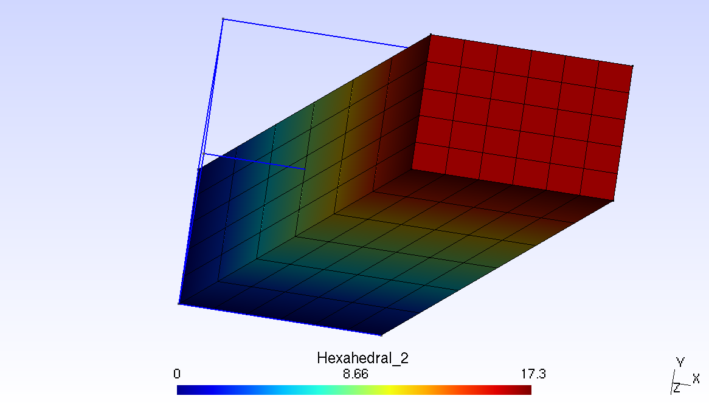
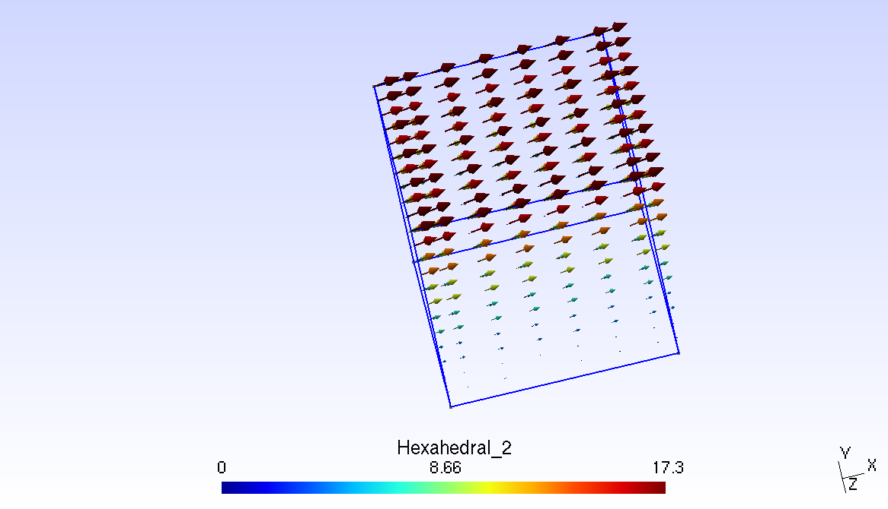
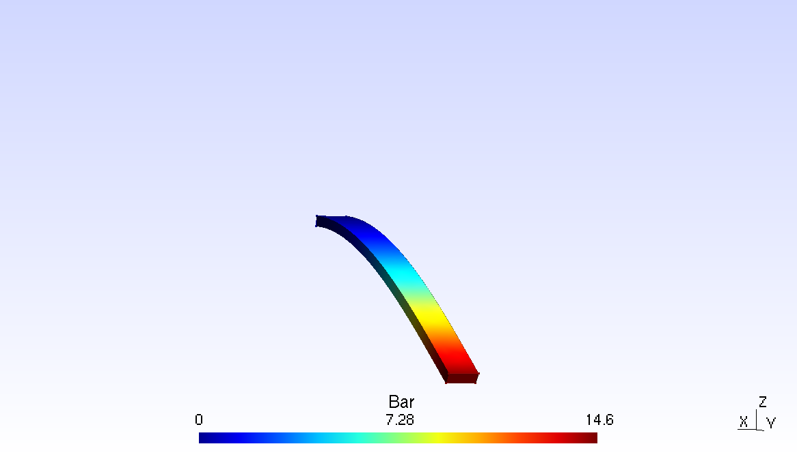

# ProjectFEA
## The goal of the project is to build an open source general finite element Library.  
  
  
The basic inputs is a .msh file generated by Gmsh (http://gmsh.info/), a free 3D finite element mesh generator.  
The weak form of can be easily declared in the main.cpp itself. All boundary conditions, Neumann as well as Dirichlet can be delared within the main file.  
The Nodes for Nuemann and Dirichlet boundary conditions are detected on the nodes declared as 'Physical Entities' in gmsh file.  
All the mesh data including physical groups must be declared within one file. For this, after meshing the domain, use 'Export..' option of Gmsh and save as '.msh' file.  
The Project is using Armadillo (http://arma.sourceforge.net) and Gmsh (gmsh.info/) APIs.   
  
This Project is a work in progress.  
  
ProjectFEA consists of mostly just header files. Hence you will need to include the whole Folder within the Cpp into your source directory.  

## A Few Examples.
A few examples and gmsh files have been provided.  
The included example source codes are, Poisson.cpp, ElasticityExample.cpp and OneElmntVrfy.cpp  

You can run the Poisson example by running,  

    ./Poisson <.msh file> <dimension of the Domain>
    
The .msh file "SampleGmsh/Hexahadral_2.msh" can be used for testing this example. Hence your input will be  
    
    ./Poisson SampleGmsh/Hexahadral_2.msh 3
    
Similary ElasticityExample.cpp can be testing by running,  

    ./ElasticityEx <.msh file> <dimension of the Domain>
  
    

    
The .msh file "SampleGmsh/Bar.msh" or "SampleGmsh/Bar2.msh" can be used for testing this example. Hence your input will be  

    ./ElasticityEx SampleGmsh/Bar.msh 3
    
  
    

    
or   

    ./ElasticityEx SampleGmsh/ElasticExHexOrdr1.png 3

  
    

  
In case of the Bar example, a case of cantilever beam is tested, where a force of 4kN is applied at the end of a (2000mm x 200mm x 60mm) bar with a fixed end at the other side. The force is applied on the surface (200mm x 60mm). Young's modulus is supposed 200 Gpa.  
By using formula delta_L =Pl^3/(3EI) we get 14.8mm deflection.  
The finite element converges to that solution as the order of the elements and the number of nodes are increased.  

## How to Compile.
Before starting in your Linux installation, make sure you at least have the following packages installed.  
(include the dev package for Ubuntu/ Debian based distributions)  
Armadillo  
BLAS  
LAPACK  
SUPERLU  
To compile the code, you need to  first download the latest Gmsh source code from gmsh.info/ and compile it.  
You can also clone it by,  

    git clone https://gitlab.onelab.info/gmsh/gmsh.git
    
The Branch currently used by ProjectFEA is gmsh_4_3_0.  
You can set it by typing  

    git checkout gmsh_4_3_0
    
Type the following in your Gmsh build directory. This will build a static library of Gmsh.  

    cmake -DDEFAULT=0 -DENABLE_BUILD_LIB=1 -DENABLE_POST=1 -DENABLE_PARSER=1 <path gmsh source directory>
    make lib
    
Clone the ProjectFEA Library by typing  

    git clone https://github.com/samadritakarmakar/Project-FEA.git
    
Copy the libgmsh.a file generated earlier to the folder ProjectFEA/Cpp/libGmshReader/GmshApi/  
The go to your build directory and type

    cmake <path to source directory>
    make
    

